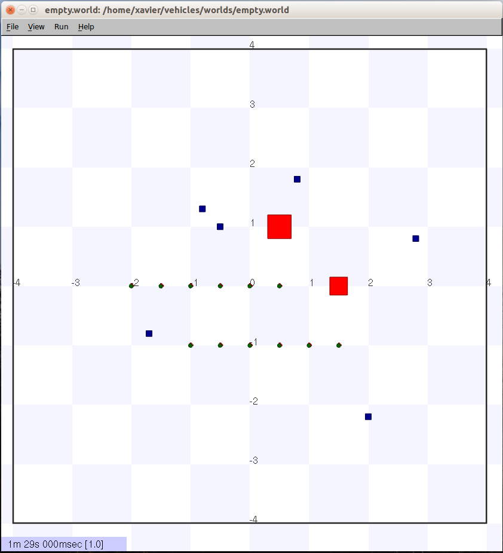
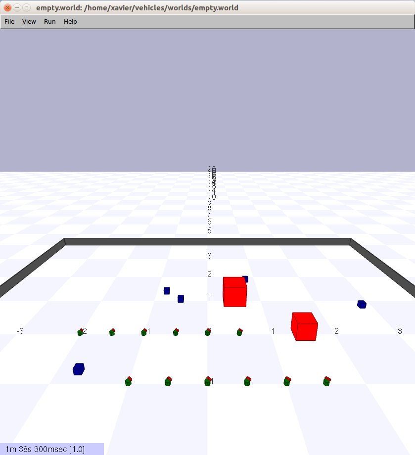

# vehicles
Simulating Braitenberg's vehicles on Player/Stage

Simulating [e-puck](http://www.e-puck.org/) robot swarm collective behaviour. Every e-puck has a very simple behaviour: wandering, obstacle avoidance and phototaxis. When the simulation begins, they start wandering until they find an obstacle or saw a blue source of light. The obstacle is avoided by changing the trajectory and the blue source of light is followed until the blue object is found and has to be avoided too.

## References

1. Braitenberg, V. Vehicles: Experiments in Synthetic Psychology. Proceedings of SAMPE Annual Conference (1986). doi:10.2307/2185146
2. Owen, J. How to use player/stage 2nd edition (2013)
